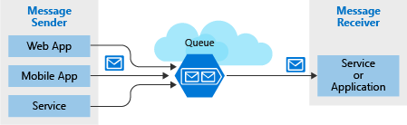

# Sandbox.AzureQueueStorage

## Disclaimer

This project is done for learning purposes. It is not necessarily production quality code.


## Overview

Implement the publish-subscribe pattern in the cloud using Azure Queue storage

A storage queue is a __high-performance message__ buffer that can act as a broker between the front-end components (the "producers") and the middle tier (the "consumer").



Each queue maintains a list of messages.

Access
- REST API
- Azure-supplied client library

A single queue can be up to __500 TB in size__, so it can potentially store millions of messages. The target __throughput__ for a single queue is __2000 messages per second__, allowing it to handle high-volume scenarios.

It __scale automatically__


## Message
- Byte array of up to 64 KB

- (48 KB when using Base64 encoding)

- If you need a larger payload you can combine queues and blobs – passing the URL to the actual data (stored as a Blob) in the message. This approach would allow you to enqueue up to 4.77 TB in a Block Blob.

```json
{
    "Message": {
        "To": "user@company.com",
        "From": "user@company.com",
        "Subject": "My subject",
        "Body": "The body message"
    }
}
```


## Settings

- Queues are only available as part of Azure general-purpose storage accounts - (v1 or v2). You cannot add them to Blob storage accounts.
- The Access tier setting which is shown for StorageV2 accounts applies only - to Blob storage and does not affect queues.
- You should choose a location that is close to either the source components - or destination components or (preferably) both.
- Data is always replicated to multiple servers to guard against disk failures - and other hardware problems. You have a choice of replication strategies: - Locally Redundant Storage (LRS) is low-cost but vulnerable to disasters that - affect an entire data center while Geo-Redundant Storage (GRS) replicates - data to other Azure data centers. Choose the replication strategy that meets - your redundancy needs.
- The performance tier determines how your messages are stored: Standard uses - magnetic drives while Premium uses solid-state drives. Choose Standard if - you expect peaks in demand to be short. Consider Premium if queue length - sometimes becomes long and you need to minimize the time to access messages.
- Require secure transfer if sensitive information may pass through the queue. This setting ensures that all connections to the queue are encrypted using Secure Sockets Layer (SSL).


## Azure cli

```bh
> az storage account create --name [unique-name] -g [resource-group] --kind StorageV2 --sku Standard_LRS

> export STORAGE_CONNECTION_STRING=`az storage account show-connection-string -g [resource-group] -n [storage account name] --output tsv`

> echo $STORAGE_CONNECTION_STRING

> az storage message peek --queue-name [queue-name] --connection-string $STORAGE_CONNECTION_STRING
```


## Access authorization

- Azure Active Directory
  - You can use __role-based__ authentication and identify specific clients based on AAD credentials.
- Shared Key Management
  - Sometimes referred to as an __account key__, this is an encrypted key signature associated with the storage account. Every storage account has two of these keys that can be passed with each request to authenticate access. Using this approach is __like using a root password__ - it __provides full access__ to the storage account.
- Shared access signature
  - A shared access signature (SAS) is a __generated URI__ that __grants limited access__ to objects in your storage account to clients. You can restrict access to specific resources, permissions, and scope to a date range to automatically turn off access after a period of time.


## Message flow


__Get and Delete__ are __separate operations__. This arrangement handles potential failures in the receiver and implements a concept called at-least-once delivery

After the receiver gets a message, that message remains in the queue but is __invisible for 30 seconds__. If the receiver crashes or experiences a power failure during processing, then it will never delete the message from the queue. After 30 seconds, the message will reappear in the queue and another instance of the receiver can process it to completion.


## Resources / Learn / Credits

- [Learn - Module](https://docs.microsoft.com/en-us/learn/modules/communicate-between-apps-with-azure-queue-storage/1-introduction)

- [Azure Storage Queues client](https://docs.microsoft.com/en-us/dotnet/api/overview/azure/storage.queues-readme)